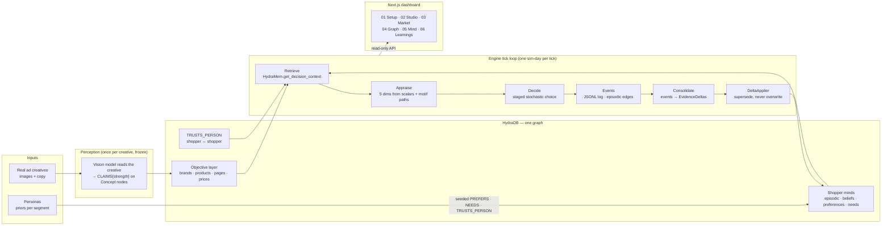
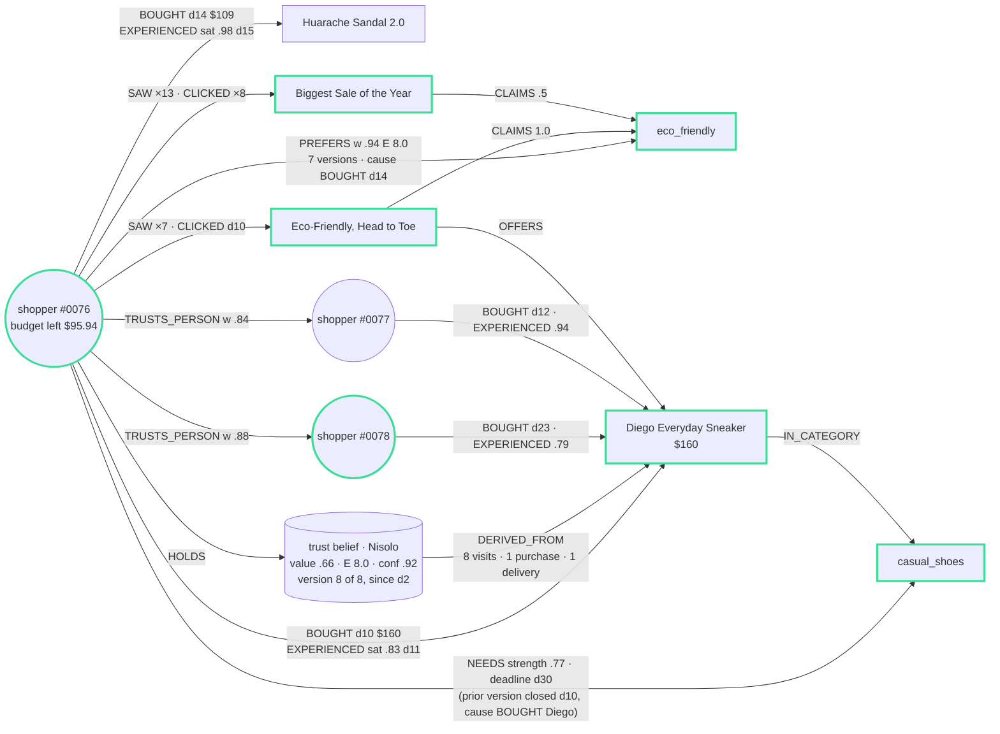

# ShopSim — shoppers who remember, on HydraDB

> These are not static personas answering prompts. Each shopper has an evolving
> model of the marketplace: what is objectively true, what happened to them,
> what they believe, what they have learned to prefer, what they currently
> need, and what people around them have experienced. HydraDB retrieves the
> portion of that evolving world model relevant to each new stimulus, and
> those paths alter subsequent behavior.

**Hack Hydra — Track 3: Memory & Context Retrieval.** Team: Garvit · Atishay.
**Live:** https://shopsim-production.up.railway.app (the dashboard, with a real
run and a real store baked in — nothing simulates on the server).

ShopSim is a market simulator for advertising. You give it real ad creatives;
a population of stateful shoppers sees them day after day; each shopper's
decision — ignore, click, browse, bounce, cart, abandon, buy — is a retrieval
from their own memory graph, and what they do is written back into that graph
as a new version of what they know. The whole memory of every shopper, and the
relationships *between* shoppers, live in one HydraDB graph. There is no vector
store, no Postgres, no per-agent JSON blob.

---

## Contents

1. [Where HydraDB is used, in one table](#1-where-hydradb-is-used-in-one-table)
2. [Architecture](#2-architecture)
3. [One stimulus, end to end](#3-one-stimulus-end-to-end)
4. [The techniques](#4-the-techniques)
   - 4.1 Typed multi-hop retrieval (motifs)
   - 4.2 A temporal graph: memory is never overwritten
   - 4.3 Provenance on every learned edge
   - 4.4 Abstention is structural
   - 4.5 Minds are relationships too: the social layer
   - 4.6 Run isolation, one writer, deterministic replay and branching
   - 4.7 Working inside HydraDB v0.1.x (what we learned)
5. [A shopper's mind is a deep relationship](#5-a-shoppers-mind-is-a-deep-relationship)
6. [The dashboard](#6-the-dashboard)
7. [Is it calibrated?](#7-is-it-calibrated)
8. [What breaks without HydraDB](#8-what-breaks-without-hydradb)
9. [Running it](#9-running-it)
10. [Honest scoping](#10-honest-scoping)
11. [Repo layout, attribution, license](#11-repo-layout-attribution-license)

---

## 1. Where HydraDB is used, in one table

Every shopper is a subgraph. Six *state families* make up a mind, and each
one is a set of typed, property-carrying edges in HydraDB — never a column,
never a document. The table is normative in the codebase
([PLAN.md §0.1](PLAN.md), [`engine/shopsim/hydramem/schema.py`](engine/shopsim/hydramem/schema.py)).

| # | State family — *the question the mind asks* | Edges in HydraDB | Why a graph and not a column |
|---|---|---|---|
| 1 | **Objective world** — *what is true?* | `CLAIMS{strength}` `PROMOTES` `OFFERS{claimed_pct}` `SHOWS` `PAGE_FOR` `HAS_ATTR` `SOLD_BY` `IN_CATEGORY` `PRICED_AT{price,t,valid_to}` | the shared truth every subjective layer diverges from; the price history is time travel |
| 2 | **Episodic** — *what happened to me?* | `SAW` `CLICKED` `VISITED` `BROWSED` `BOUNCED` `CARTED` `ABANDONED` `BOUGHT{price}` `PRICE_SEEN{price}` `EXPERIENCED{sat}` — all `{t, run}` | raw evidence, chronological, replayable; every later belief can point back at one of these |
| 3 | **Subjective worldview** — *what do I believe?* | reified **Belief** node `{value, evidence, t, valid_to}` + `HOLDS{t,valid_to}` `ABOUT→brand` `THAT→aspect` `DERIVED_FROM{kind,count,first_t,last_t,weight}`; `EXPECTS{about,strength,valid_to,cause_id}`; `REFERENCE_PRICE{price,valid_to}` | provenance edges; belief-versus-truth divergence as of any tick; no live `HOLDS` edge = unknown brand |
| 4 | **Preferences & habits** — *what do I like and do?* | `PREFERS{w, evidence, source, cause_kind, cause_id, t, valid_to}` `HABIT{evidence, valid_to}` | the supersession chain **is** the provenance timeline of a person's taste |
| 5 | **Goals** — *what do I need right now?* | `NEEDS→Category{strength, budget_cap, deadline_t, valid_to, closed_cause_kind, closed_cause_id}` | `goal_fit` is a real 3-hop join need→category→product→creative, with a queryable lifecycle |
| 6 | **Social context** — *what did people I trust experience?* | `TRUSTS_PERSON{w}` shopper↔shopper | inherently relational; influence is a path through someone else's memory |

Vocabularies are closed and shared ([`contracts/enums.py`](engine/shopsim/contracts/enums.py)):
30 `Concept`s (ids 5000–5029), 10 `Category`s (5500–5509), 8 `MotifType`s, 10
episodic `EventType`s. Ids are integers from one allocation map
([`contracts/ids.py`](engine/shopsim/contracts/ids.py)): shoppers
`1_000_000 + run_index·100_000 + offset`, creatives `2_000_000+`, products
`3_000_000+`, pages `4_000_000+`, belief versions `8_000_000+`.

Where the code touches the store — all of it inside one package,
[`engine/shopsim/hydramem/`](engine/shopsim/hydramem/):

| file | role |
|---|---|
| `client.py` | Bolt transport (neo4j driver, `bearer_auth`), one statement per request, thread-local sessions, `run_grouped` for cross-shopper parallelism |
| `schema.py` | the relationship catalog above; `cypher.py` refuses any rel/prop not listed here |
| `cypher.py` | every Cypher template the engine is allowed to send (create, supersede, live/history/window reads, adjacency batches) |
| `reads.py` | the retrieval path: per-tick objective cache + per-shopper single-hop reads + Python assembly of scalars and motif paths |
| `writes.py` | catalog ingestion, episodic events, supersession, belief versioning, the bounded evidence applier |
| `memgraph.py` | a cohort's subgraph with full edge history, for the Graph and Mind exhibits |
| `real.py` | `HydraMem` — the C1 interface the minds consume |

The dashboard never talks to HydraDB directly (Law 8, one admitted writer):
it reads through the engine API ([`runner/api.py`](engine/shopsim/runner/api.py)),
which reuses the same `HydraMem` read methods for worldviews, traces,
preference histories and memory graphs.

---

## 2. Architecture



The repo is laid out along those boxes:

```
engine/shopsim/
  perception/   the vision model reads each creative once; claims are cached and frozen
  hydramem/     HydraMem — everything that speaks Cypher
  minds/        appraise() · decide() · consolidate() — pure functions, they never write
  runner/       the tick loop, event log, run store, resume/branch, the read-only API
  experiments/  specs, arms, orchestrator, cross-arm comparison
  analytics/    the C3 MetricsReport with bootstrap CIs
  eval/         Phase 7: analytic, scenario and audit tiers
  contracts/    the shared enums, ids, evidence table, types
web/            Next.js dashboard (reads only through the engine API)
infra/          HydraDB compose (pinned digest) + the one-container Railway deploy
eval/           calibration evidence, profiles, specs, results, plots
fixtures/       brands, perception caches, frozen exhibits, golden run
CONTRACT.md     the three inter-lane contracts (C1 HydraMem · C2 Minds · C3 Results), versioned
PLAN.md         the build plan and its 16 laws
```

**Per tick, for every shopper and every stimulus they are shown:**

1. `get_decision_context(shopper, stimulus)` — HydraMem reads the shopper's
   live edges (single hops), joins them in Python against a per-tick cache of
   the objective layer, and returns a **DecisionContext**: 13 scalars plus a
   list of typed **motif paths** ([CONTRACT C1](CONTRACT.md)).
2. `appraise()` turns scalars + paths into interpretable 0–1 appraisal
   dimensions — relevance, credibility, brand-message fatigue, expectation
   alignment, offer attractiveness, and with the social layer on, social proof
   (`minds/appraisal.py`).
3. `decide()` runs the staged choice model — four gates, each one Bernoulli
   draw against a logistic `P = σ((U − θ)/τ)`.
4. The outcome is appended to the JSONL log **first**, then written to HydraDB
   as episodic edges.
5. `consolidate()` — pure — turns the tick's events into **EvidenceDeltas**
   using the one evidence table ([Appendix F](CONTRACT.md)); the
   `DeltaApplier` reads current `(w, E)`, blends, and writes a **new version**
   of each affected edge. The old version is closed, not deleted.
6. A fsync'd `TICK_COMPLETE` marker lands only after every graph write, so a
   crash mid-tick is always recoverable by timestamp.

---

## 3. One stimulus, end to end

This is the contract's reference DecisionContext — shopper `1000042` shown
creative `2000003` ([CONTRACT.md C1](CONTRACT.md), verbatim). Everything the
mind will reason about is either a scalar or a **typed path through the
graph**:

```json
{
  "scalars": {
    "shopper_id": 1000042, "aware_of_brand": true,
    "adstock": 0.62, "exposures_72h": 3, "last_seen_t": 1755150000,
    "reference_price": {"3000001": 39.0}, "current_price_gap": -0.15,
    "budget_left": 120.0, "cart": [],
    "trust_belief":   {"value": 0.70, "evidence": 3.0, "confidence": 0.81},
    "quality_belief": null,
    "active_need":    {"category": 5504, "strength": 0.8, "urgency": 0.7, "budget_cap": 90.0},
    "habit":          {"stim_brand": 0.0, "rival_max": 0.55}
  },
  "motifs": [
    {"type": "goal_fit", "strength": 0.8, "urgency": 0.7,
     "path": [1000042, "NEEDS", 5504, "IN_CATEGORY", 3000001, "OFFERS", 2000003]},
    {"type": "preference_fit", "strength": 0.61, "evidence": 2.85, "recency": 1.0,
     "path": [1000042, "PREFERS", 5003, "CLAIMS", 2000003]},
    {"type": "brand_semantic_fatigue", "strength": 0.6, "recency": 0.7, "brand": 6001,
     "path": [1000042, "SAW", 2000001, "CLAIMS", 5003, "CLAIMS", 2000003]},
    {"type": "expectation_violation", "strength": 0.9,
     "path": [1000042, "EXPECTS", 5011, "NOT_SHOWN_BY", 4000002]},
    {"type": "social_proof", "valence": 0.8, "peer_trust": 0.7, "experience": 0.9,
     "path": [1000042, "TRUSTS_PERSON", 1000077, "BOUGHT", 3000001]}
  ]
}
```

Read the paths as sentences. *She needs running shoes (5504); this product is
in that category; this creative offers it* — three hops. *She has seen a
different creative of the same brand claim eco-friendly (5003), and this one
claims it again* — fatigue, via the brand's other ad. *Someone she trusts
(1000077) bought the product this ad sells* — social proof, through another
shopper's memory. The appraisal consumes exactly these; the trace for the
Inspector carries the same paths with thresholds relaxed, so the dashboard
explains a decision with the evidence the engine actually used.

---

## 4. The techniques

### 4.1 Typed multi-hop retrieval (motifs)

Retrieval is a **motif library** — eight named path shapes, each with a
documented entry point into the mind ([CONTRACT Appendix E](CONTRACT.md)):

| motif | path signature | hops | enters the mind at |
|---|---|---|---|
| `preference_fit` | shopper `PREFERS` concept `←CLAIMS` creative | 2 | relevance |
| `goal_fit` | shopper `NEEDS` category `←IN_CATEGORY` product `←OFFERS` creative | 3 | relevance (strength × urgency) |
| `brand_semantic_fatigue` | shopper `SAW` creative₁ `CLAIMS` concept `←CLAIMS` creative₂, same `PROMOTES` brand | 3 (+brand join) | brand-message fatigue |
| `expectation_violation` | shopper `EXPECTS` concept, page does not `SHOWS` it | 2 (set difference) | expectation alignment |
| `concept_saturation` | `SAW · CLAIMS · CLAIMS` across *other* brands | 3 | novelty (inverse) |
| `social_proof` | shopper `TRUSTS_PERSON` peer `BOUGHT` product (`EXPERIENCED` gives valence) | 2–3 | social proof |
| `experience_path` | `EXPERIENCED · SOLD_BY · PROMOTES` | 3 | explanatory only — effect arrives via the trust belief |
| `habit_path` | `BOUGHT · SOLD_BY` history | 2 | explanatory only — effect arrives via habit scalars |

Two things about how they are executed, both measured live against the pinned
image ([CONTRACT "Routing"](CONTRACT.md), [`engine/bench/probe11.py`](engine/bench/probe11.py)):

- **Every motif traverses at least one edge against its stored direction**
  (`PREFERS→concept←CLAIMS`). HydraDB's `algo.SPpaths` is strictly
  direction-following and cannot return edge properties, so it returns zero
  paths for all of them. So retrieval is **Route B**: per-shopper single-hop
  reads (`live_edges`, `events_since`, `live_holds` in `cypher.py`, ~0.3 ms
  each, 0.35 ms median / 0.46 ms p95 per statement) joined in Python against a
  **per-tick objective cache** (the whole objective layer, rebuilt once a tick
  from ~50 cheap statements). A full context costs ≈ 9 ms warm; 200 shoppers ×
  1 stimulus batched ≈ 0.6 s.
- **The multi-hop join happens over graph-shaped data, in the engine.** The
  store holds the edges; `reads.assemble_context` walks them. That is what
  makes `goal_fit` a real three-hop join rather than a feature lookup, and what
  lets `get_trace` hand back the *same* paths with relaxed thresholds.

Signals that are genuinely scalar stay scalar (Law 16, "no graph theatre"):
reference price, price gap, budget, adstock, wearout, belief values. Paths
are used where relationships matter.

### 4.2 A temporal graph: memory is never overwritten

HydraDB v0.1.x has no `IS NULL`, so liveness is a **sentinel bitemporal**
scheme (PLAN decision 1): every edge on a subjective layer carries
`valid_to`, live edges carry `valid_to = 9_007_199_254_740_991`, and an update
is *supersede + create*:

```cypher
-- close the current version (cypher.supersede_edge)
MATCH (a {id: $a})-[e:PREFERS]->(b {id: $b}) WHERE e.valid_to > $now SET e.valid_to = $now
-- write the new one (cypher.create_edge)
CREATE (a {id: $a})-[:PREFERS {w: $w, evidence: $E, source: 'learned',
                               cause_kind: 'BOUGHT', cause_id: $event, t: $now,
                               valid_to: 9007199254740991}]->(b {id: $b})
```

The bitemporal set is `PRICED_AT · HOLDS · EXPECTS · REFERENCE_PRICE · PREFERS
· HABIT · NEEDS` (`schema.BITEMPORAL_EDGES`). Consequences:

- **As-of-T reads are one WHERE clause.** `live_edges` filters
  `e.valid_to > $now`; `all_edges` / `edge_history` return the whole chain and
  the client sorts. The Inspector's preference timeline, the Graph page's day
  scrub, and the memory-graph export all read `t <= as_of < valid_to` — the
  same discipline everywhere (`memgraph.py` docstring).
- **Beliefs are reified and versioned by id.** A new belief version is a new
  node (`8_000_000 + run·1_000_000 + n`); the old `HOLDS` edge is closed and
  the old node keeps its own `valid_to`. Belief history is therefore a list of
  nodes, each with its evidence, each pointing at what caused it.
- **Prices are history too.** `PRICED_AT{price, t, valid_to}` on the objective
  layer means a promo is a supersession, and a branch replay serves the
  original arm's price history as-of each tick.
- **Goals have a lifecycle in the graph.** `NEEDS` is opened with a deadline,
  and *satisfied with cause*: the closing supersession stamps
  `closed_cause_kind / closed_cause_id` (the BUY that met it). `NEED_*` records
  exist only in the log; the graph carries the versions.
- **Rollback is by timestamp.** Every write of tick *k* has `t == now_k` on
  creates or `valid_to == now_k` on supersessions, so a partial tick is
  identifiable and `rollback.py` undoes it without a separate undo log.

This is the flagship "what breaks without HydraDB" item: *preference
time-travel* — `PREFERS` supersession chains with cause receipts — is a
question you can ask the store as of any day, not a chart recomputed from logs.

### 4.3 Provenance on every learned edge

Learning has one formula, everywhere ([`contracts/evidence.py`](engine/shopsim/contracts/evidence.py), Appendix F):

```
w' = (E·w + wt·target) / (E + wt)        E' = min(E + wt, 8)        confidence = E / (E + 0.7)
```

The weights are the evidence hierarchy: `SAW → 0` on taste (exposure teaches
expectations, never preference), `CLICK 0.10 < BROWSE 0.25 < CART 0.50 < BUY
1.00`, `EXPERIENCED ±0.75·(2·sat−1)` toward what the product actually has.
Each write carries its cause: `PREFERS{cause_kind, cause_id}`; each belief
version carries `DERIVED_FROM{kind, count, first_t, last_t, weight}` edges the
Inspector renders as a sentence of the form "from 4 visits, 1 purchase and
1 delivery" (`hydramem/real.py`, `_provenance_sentence`).

Measured on the shipped run `r072` (`provenance_coverage` in its results — `runs/` is
gitignored, so read it live: [`/api/sim/runs/r072-shopper-mind-demo-market/results`](https://shopsim-production.up.railway.app/api/sim/runs/r072-shopper-mind-demo-market/results)):
**97.4 %** of subjective versions carry a cause; all **99** live belief versions
do; the 3,988 learned `PREFERS` versions were caused by `BROWSED 1888 ·
CLICKED 1254 · CARTED 339 · BOUGHT 205 · EXPERIENCED 195 · VISITED 107` — and
**`SAW` never appears**, which is the never-drop law F7a and is audited on
every eval run.

Writes are bounded (Law 14): skip `|Δw| < 0.01`, at most 6 subjective writes
per shopper per tick, priority need-satisfy > trust > preferences > expects.
Contract-tested golden chain: eco prior 0.45 (E=2) → CLICK 0.476 → BROWSE
0.532 → CART 0.614 → BUY 0.714 → positive experience 0.761 (E=4.6,
confidence 0.87).

### 4.4 Abstention is structural

HydraDB nodes are implicit by integer id (there is no bare-node CREATE), so
"does this shopper know this brand?" cannot be answered by node existence. It
is answered by **edges**: no live `HOLDS` edge for the brand → `trust_belief:
null`; no live `PREFERS` overlapping the creative's claims → no
`preference_fit`; no matching live `NEEDS` → `active_need: null` *and* no
`goal_fit` (the validator enforces the biconditional). An empty `motifs` list
is a valid context — no paths, no knowledge — and appraisal floors to
neutral-low instead of inventing familiarity. Laws F2 and F6 in the eval
suite measure exactly this (cold-start engagement 0.25× warm; gated
"hallucinated familiarity" 0.25× an ungated strawman).

### 4.5 Minds are relationships too: the social layer

A shopper's mind is a subgraph. But the minds are also **nodes in each
other's graphs**: `TRUSTS_PERSON{w}` is a shopper→shopper edge, seeded as a
small-world network (degree 4, rewire 0.1, `w ∈ [0.4, 0.9]` in the shipped
spec). That makes another person's memory *external state* this shopper can
retrieve:

```
shopper ─TRUSTS_PERSON{w}→ peer ─BOUGHT{t,price}→ product ←OFFERS─ creative
                           peer ─EXPERIENCED{sat}→ product        (valence)
```

When Jack buys a product and it arrives well, Owen's next decision on an ad
for that product carries a `social_proof` motif with Jack's `peer_trust` and
`experience` — one person's experience reshaping another's appraisal, through
an edge between them. Reads are as-of the previous tick (no intra-tick
feedback loops); `TRUSTS_PERSON` is the only relationship whose destination is
a shopper, which is also how `memgraph.py` recovers the shopper set exactly.

Measured, not asserted: the engine reports `social_lift` per run as the
purchase rate on decisions that carried a `social_proof` motif versus those
that did not. `r049` (the Graph exhibit's source): **1.32×, causal: true**
(3.95 % vs 3.00 %, 430 vs 1,102 decisions). `r072` (the Mind exhibit's source
and the run on the live site): **1.26×, causal: true** (4.9 % vs 3.9 %, 407 vs
1,157 decisions).

### 4.6 Run isolation, one writer, deterministic replay and branching

- **Run isolation by id block.** `shopper_id = 1_000_000 + run_index·100_000 +
  offset`; belief ids in a per-run block; `TRUSTS_PERSON` never crosses a
  block. Many runs share one store without touching each other.
- **One admitted writer** (Law 8). The engine process owns every graph
  write; minds return deltas and never write; the dashboard reads through the
  engine. Shoppers are disjoint subgraphs, so `client.run_grouped` writes
  different shoppers in parallel while keeping canonical `(t, event_rank)`
  order inside each.
- **Determinism by freezing** (Law 13). Perception is read once per creative
  and cached; the run manifest carries hashes of the perception cache, the
  evidence table, the goal config, the latent-quality table, the social config
  and the run config. Every random draw comes from a seeded substream keyed on
  offsets, so the same seed reproduces the same trajectory in any run block.
- **Branch = replay + diverge** ([`runner/replay.py`](engine/shopsim/runner/replay.py)).
  Arm B replays arm A's event log into a fresh shopper block up to tick *T* —
  **recomputing** every worldview by re-running the consolidator over the
  events, never copying stored deltas — then continues with its own config
  delta. One seed, two histories, paired populations by construction; that is
  how the N-arm discount ladder and the need-on/need-off twin (F9) are built.
- **Crash-safe ticks.** Log before graph; timestamp every write; marker last;
  resume rolls the partial tick back by timestamp and re-runs it.

### 4.7 Working inside HydraDB v0.1.x (what we learned)

All of this was probed live on the pinned image and is recorded in
[`infra/README.md`](infra/README.md) and [CONTRACT.md](CONTRACT.md):

| constraint (measured) | how ShopSim works with it |
|---|---|
| Edge-only model — no bare-node CREATE; nodes exist implicitly by id | anchor nodes from the unallocated 7,000–7,999 gap (`PRICEBOOK`, `CATALOG`, aspect anchors) so single-node facts hang off an edge; absence lives on edges, never nodes |
| One statement per request; no `MERGE…SET`, no `MATCH…CREATE` | multi-step writes sequenced client-side; `cypher.py` is the only place Cypher is composed |
| No aggregates (`count()` rejected) | all counting, scoring and decay in Python |
| `UNWIND` batching: one rel type, no props; reads return `row.sid, x.id` only | `adj_batch` for adjacency sweeps (`find_social_triads` walks the population in 1,024-item chunks, the admission cap) |
| `algo.SPpaths` is direction-following and propless | Route B everywhere (§4.1) |
| Prop-carrying writes commit at ~200–230 stmts/s regardless of parallelism | log-first ticks, bounded subjective writes, write-grouping across shoppers; per-tick cost is dominated by consolidation |
| Per-tick cost grows with the store: the same 200 × 60 shape measured 18.5 s/tick fresh and 112 s/tick loaded | `GET /engine/pace` publishes observed pace so the dashboard's ETA tracks the store; the store-reset ritual archives (`mv`, never `rm`) before timed runs |
| Bolt with `bearer_auth`; plaintext allowed locally; pinned digest | `client.py`; `infra/docker-compose.yml`; the Railway image is the same digest |

---

## 5. A shopper's mind is a deep relationship

The 05 Mind page draws one shopper's **real HydraDB worldview** as a head with
six lobes — the six state families — and lights the retrieval path for the
currently selected ad. It is a photograph of run `r072`, shopper #0076 (the
lead of the best mutually-trusting triad), as of day 27 of 28: **65 nodes ·
459 edges · 27 traces · 10 baked decision previews**
([`fixtures/shopper-mind/README.md`](fixtures/shopper-mind/README.md)).

The values below are hers, read from `mind.json` as of day 27 (the lit path is
the eco ad's decision; `d` = simulated day):



Her baked decision preview for that ad carries exactly four motif paths —
`preference_fit` .94 (`PREFERS eco_friendly ← CLAIMS`), `goal_fit` .77
(`NEEDS casual_shoes ← IN_CATEGORY Diego ← OFFERS`, three hops),
`brand_semantic_fatigue` 1.0 (the sale ad already made the eco claim to her:
`SAW sale ad · CLAIMS eco · CLAIMS eco ad`) and `social_proof` (`TRUSTS_PERSON
#0078 · BOUGHT Diego`) — which appraise to relevance .77, credibility .90,
social proof .76, fatigue 1.0, and a click gate of **P = 0.454**. The buy gate
is closed by a scalar, not a path: the sneaker costs $160 and she has $95.94.

Every solid line on the page is an edge that came out of HydraDB through the
shipped read API; dashed lines are engine-derived (the relaxed-threshold trace
candidates); the lobe connectors are a legend and are styled apart so nothing
on screen pretends to be stored when it is not. The right-hand panels show the
appraisal the lit paths produced and the four gate probabilities — computed at
export time by the very same `appraise()` / `stage_probabilities()` the live
endpoint runs, with the shopper's traits never leaving the engine (Law 12/15).

Two properties of the mind that only a graph store makes natural:

- **Depth.** The thing that drives a decision is rarely one hop away. A
  purchase decision reads the shopper's own preference versions, a belief that
  points at the visits and purchases that formed it, a need that points at a
  category that contains the product this ad offers, and a trusted peer's
  experience of that product. That is a small neighbourhood, three hops deep,
  around one node — and it is different for every shopper and every day.
- **Externality.** Part of a shopper's mind lives in other shoppers.
  `TRUSTS_PERSON` edges make minds *relationships* in HydraDB, and the 04 Graph
  page shows three of them — Owen, Duaa and Jack — as one connected graph with
  every edge's version history, scrubbed by day
  ([`fixtures/social-graph/README.md`](fixtures/social-graph/README.md): 69
  nodes · 355 edges · 20 traces; 28 `social_proof` motifs across the traces).

---

## 6. The dashboard

`web/` is a Next.js app with a numbered shell. Every page reads the engine API
(`/api/sim/*` → `runner/api.py`); the dashboard never writes the graph.

| page | what it shows | reads |
|---|---|---|
| **01 Setup** | runs and experiments on this engine | `/runs`, `/experiments` |
| **02 Studio** | real creatives (Nisolo's five image ads; upload your own), the perceived claims, launch | `/catalogs`, `/experiments/{name}/ads-manifest`, `POST /experiments` |
| **03 Market** | the flight: KPI row, allocation river, ad roster, timeline, detected events, the Inspector (any shopper's worldview, preference history, belief history, decision preview) | events / results-live / config / population; `shoppers/{offset}/worldview · trace · preference-history · decision-preview` (HydraDB) |
| **04 Graph** | the social memory graph: three mutually-trusting shoppers, every edge with history, day scrub, Explain mode lighting the motif paths | the committed capture; `?run=<id>` reads the store live |
| **05 Mind** | the pinned shopper's mind, lit by the current ad, with appraisal and gate probabilities | the committed capture + the catalog's cards |
| **06 Learnings** | the full C3 report: funnel with bootstrap CIs, CTR by day and creative, the three fatigue channels, preference and belief drift, goal-conversion split, recommendations that cite their numbers | `/runs/{id}/results` |

The Market's headline CTR and ROAS are read **at the calibrated gate**: the
demo profile accelerates only the click gate so a short run draws enough
samples, the engine publishes the multiple per run (`effective.click_gate`,
CONTRACT v3.13-draft), and the page divides by it and prints the raw rate
beside.

---

## 7. Is it calibrated?

Yes, against published ranges, and the evidence is generated, not typed:
[`eval/`](eval/INDEX.md) (`make eval` reproduces every number and plot;
[`eval/README.md`](eval/README.md) is the current report).

| metric | published band | reference profile | source ([`eval/market-research.md`](eval/market-research.md)) |
|---|---|---|---|
| P(click \| exposure) | 0.5–2 % | 0.89 % ✓ | Meta retail CTR 1.59–1.71 % |
| bounce rate | 45–55 % | 54.0 % ✓ | 1 − BROWSE |
| P(cart \| browse) | 10–20 % | 14.2 % ✓ | fashion add-to-cart ~7 % of sessions, ~2× on non-bounce |
| P(buy \| cart) | 24–28 % | 24.3 % ✓ | 1 − cart abandonment (72–76 %) |
| visit → purchase | 1–3 % | 1.6 % ✓ | apparel sitewide conversion |

What the calibration actually found ([`eval/calibration.md`](eval/calibration.md))
is the useful result: most of what looked like a mis-tuned choice model was
**two retrieval constants and a degenerate cold start** — taste was decaying
at the half-life of an ad (3 days; now 30 for preferences, 3 for repetition),
every landing page "violated" an expectation because the violation had no
floor, and the first click on a new concept ended learning on contact. Only
one mind constant moved (`stage_bases.BUY` 3.2 → 2.85).

Twelve face-validity laws, each with a test proving it can go red. Current
verdicts (scenario tier on the demo profile):

| law | result |
|---|---|
| F1 frequency response rises then wears out · F2 cold start ≈ 0 · F3 discount uplift ordered by price sensitivity · F6 abstention · F8 CLICK < BROWSE < CART < BUY · F10 confidence-differential updating | PASS (analytic) |
| F5 the violating page variant bounces more (0.42 → 0.56) · F12 repetition decays CTR faster than rotation | PASS (real runs) |
| F7a no learning from exposure — **never-drop** | PASS (audit, every run) |
| **F9 the Maya law: a goal moves BUY more than it moves CTR — never-drop** | **FAIL** — ordering holds (BUY ×1.095 > CTR ×1.032) but both floors are missed on 21 vs 23 purchases; left open as a scenario-design question rather than tuned away |
| F4, F7b, F11 | not measured in this pass (named, not omitted) |

Rank agreement with an oracle over five seeds: Spearman ρ 0.86 (worst 0.70).
475 tests in 43 modules under `engine/tests` (`make test`), plus 11
integration modules against a live store (`make test-real`).

---

## 8. What breaks without HydraDB

Worldview-divergence queries (belief vs truth, as of any tick) · typed motif
paths per decision (one evidence set, not a similarity score) · preference
time-travel (`PREFERS` supersession chains with cause receipts) ·
goal-lifecycle joins (need ↔ category ↔ product ↔ creative, three hops) ·
belief provenance (which event made them sure, and how sure) · branch and
replay (one seed, two histories, compared) · social influence paths (who they
trust, and what those people experienced).

---

## 9. Running it

```bash
# 1. HydraDB (pinned digest; creates store/, cache/ and the local auth token)
infra/up.sh && curl -fsS http://127.0.0.1:9090/readyz

# 2. engine
cd engine && python3.11 -m venv .venv && . .venv/bin/activate && pip install -e '.[dev]'
python -m shopsim.runner serve --config ../fixtures/run-configs/scripted-run-1.json --port 8000

# 3. dashboard
cd ../web && npm ci && npm run dev        # http://localhost:3000, proxies /api/sim → :8000

# a run, from the CLI
cd ../engine
python -m shopsim.experiments run --spec ../fixtures/run-configs/shopper-mind-demo.json --verbose
python -m shopsim.analytics report --run <run id> --config ../runs/experiments/shopper-mind-demo/run_config.json

# evals
make eval-fast     # analytic + calibration + rank + report — seconds, no database
make eval          # everything, including the real scenario runs
```

Before a long run read [`infra/README.md`](infra/README.md) "Engine pace and
the store-reset ritual" — "the simulation is slow" is usually "the store is
full". Secrets live in `.env.local` (gitignored); only live ad ingestion needs
`OPENAI_API_KEY` — every run is offline against the frozen perception cache.

**Deploying.** [`infra/railway/`](infra/railway/) ships the dashboard as one
container — HydraDB, engine and Next on localhost inside the image, with the
runs and the live store baked in — so the public URL shows a real run and
nothing simulates on the server. `infra/railway/stage.sh` assembles the
upload tree; `railway up <stage> --path-as-root` deploys it.

---

## 10. Honest scoping

- Retrieval is a **motif library** — controllable behavioural laws, by design
  — not learned retrieval. Adding a mechanism is a motif-enum row, a classifier
  case and a registry row; no schema change.
- Goals are **exogenous**. The simulator demonstrates demand *capture*, not
  demand *creation*.
- Write throughput is the binding constraint of the pinned HydraDB build
  (~200–230 prop-carrying statements/s), and per-tick cost grows with the
  store. The largest run on disk is 200 shoppers × 60 days; "5,000 shoppers ×
  60 days" on the landing page is design scale and is labelled as such.
- F9 is a never-drop law and is currently red; F7b has not been measured. The
  eval report says so and `make eval` exits non-zero until they pass.
- Every shopper is fictional, and so are the demo-brand fixtures (ShoeCo,
  TrailForge, UrbanStride). **Nisolo is a real brand** — a Certified B Corp
  footwear company; the five creatives are the brand's own campaign images
  supplied for this simulation, and prices and product facts are the real ones
  (`eval/market-research.md` §6). Shopper reactions are modelled; the
  generated ad copy is written for this simulation and is not Nisolo's
  published marketing ([`fixtures/nisolo/README.md`](fixtures/nisolo/README.md)).

---

## 11. Repo layout, attribution, license

```
engine/    Python 3.11 — HydraMem, minds, runner, experiments, analytics, eval, contracts
web/       Next.js dashboard
infra/     HydraDB compose (pinned digest) · Railway one-container deploy
eval/      calibration evidence: profiles, specs, results, plots, the generated report
fixtures/  brand catalogs, frozen perception caches, the two frozen exhibits, golden run
CONTRACT.md  C1 HydraMem · C2 Minds · C3 Results — versioned; changes need a call
PLAN.md      the build plan, the 16 laws, and every amendment with its date
```

- Our code: MIT ([`LICENSE`](LICENSE)). HydraDB itself is AGPL and stays server-side.
- Aggregate CTR calibration ranges: Criteo / Avazu public datasets and the
  published sources listed in `eval/market-research.md`.
- The research framing cites Guan et al., *Modeling Earth-Scale Human-Like
  Societies with One Billion Agents* (arXiv:2506.12078) for the observation
  that state, not agents, is the hard part; ShopSim's answer to *where state
  lives between transitions* is HydraDB.
